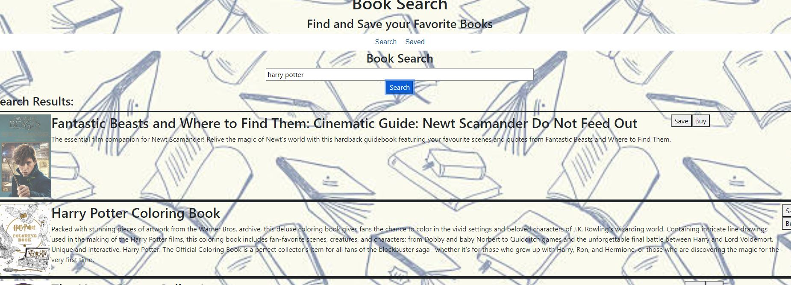

# bookMERN

# Table of Contents 
1. [Project Description](#description)
2. [Installation Process](#installation)
3. [Usage](#usage)
4. [Image](#image)
5. [Questions](#questions)
    
## Description: 
A site where you can search books. You may save the books to a list or go to google books. In the list you can also delete books from it.
## Installation: 
npm install
## Usage: 
npm start
## Image:

## Questions: 
Any questions, comments, or concerns, please feel free to contact me at:
* Github: (https://github.com/mknauss97)
* Deployed: ()
* Email: mknauss97@gmail.com
